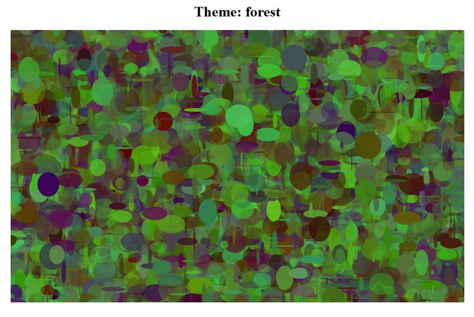
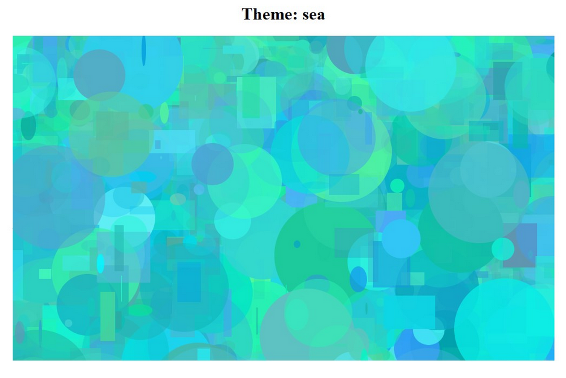
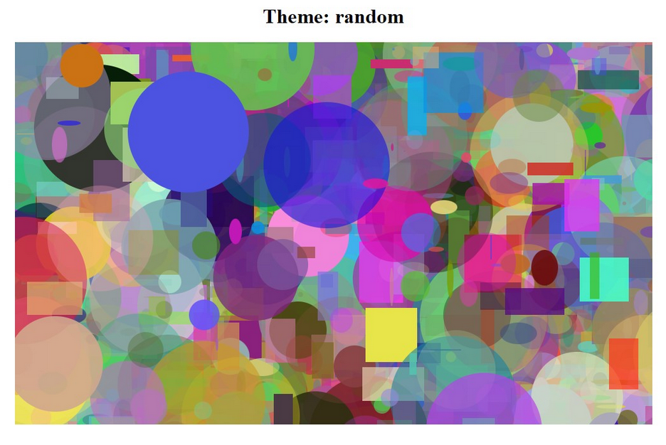

# Art Generator

Art Generator is a Python project that embeds SVG into HTML to create unique web-page art consisting of several shapes such as circles, ellipses, and rectangles. By utilizing several of these random shapes and tuning their colors, this art generator creates HTML pages of themes 'Sea', 'Forest', and 'Random'. 

## Usage
To use the Art Generator, simply run:
```python
./gen_art.py
```

## Examples
Below are screenshots of the rendered HTML files:





